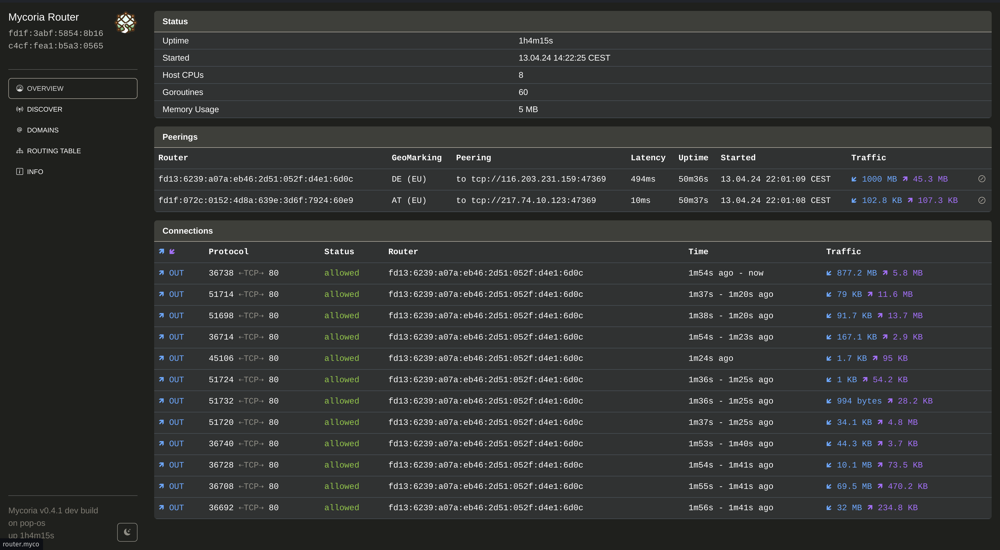
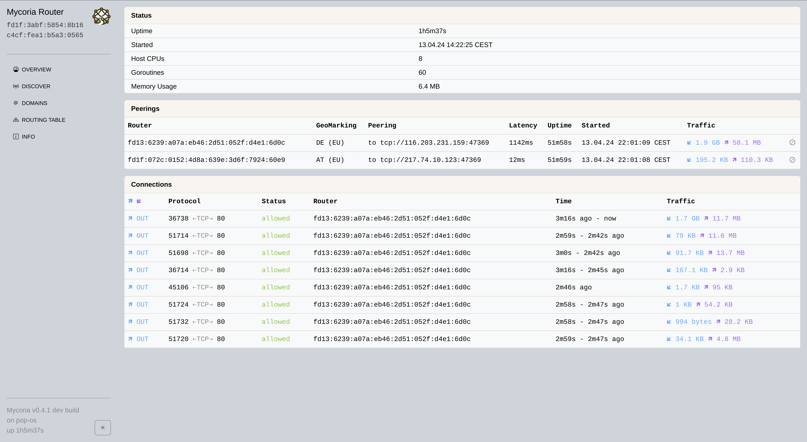
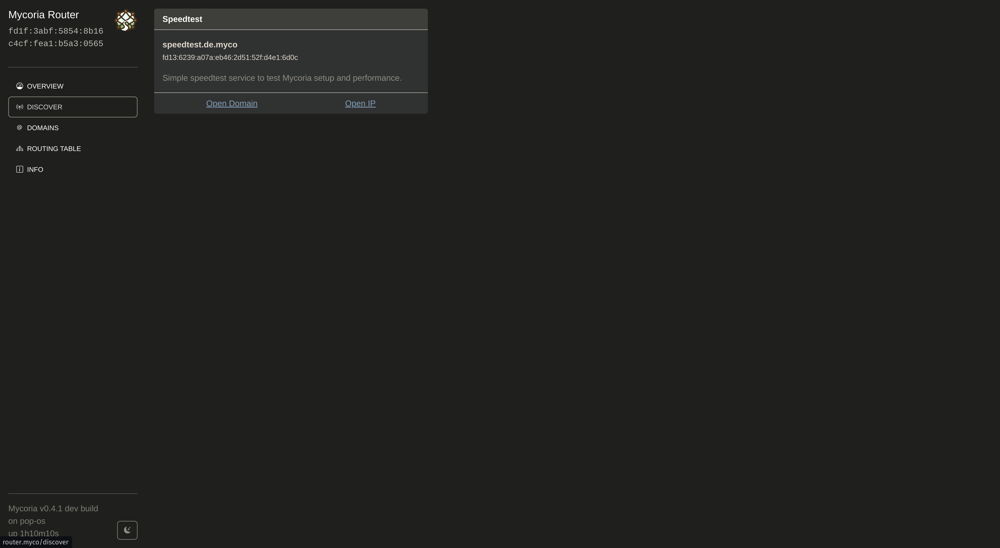
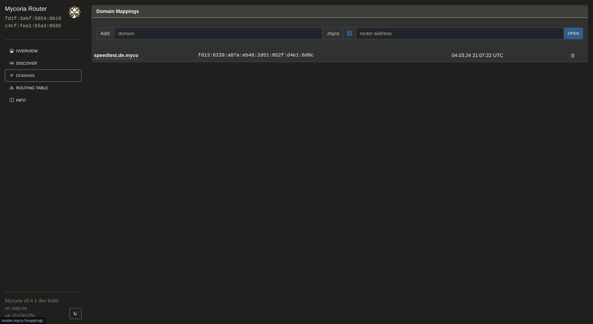
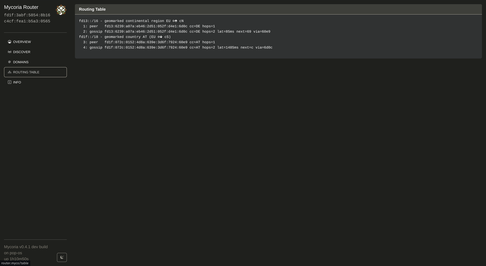
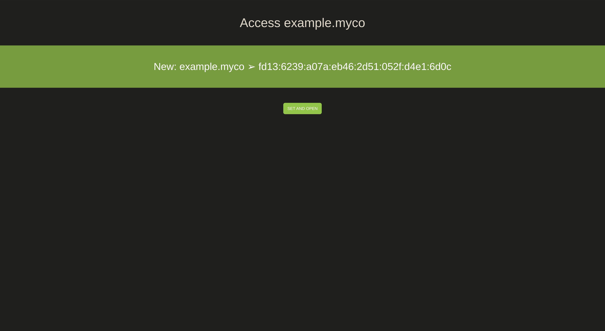
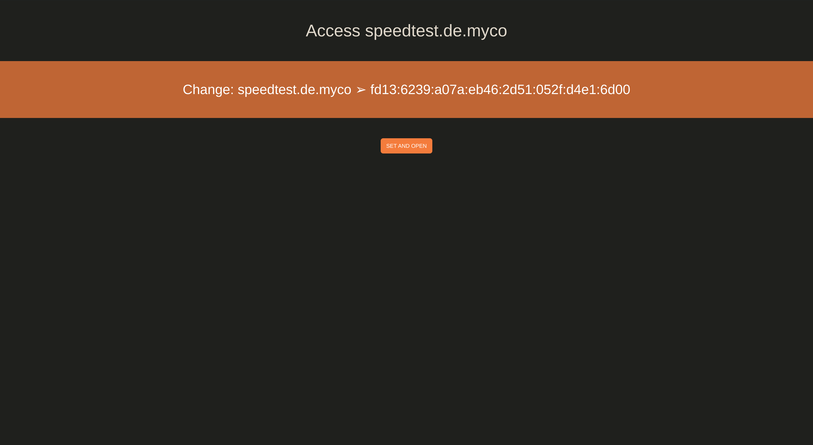
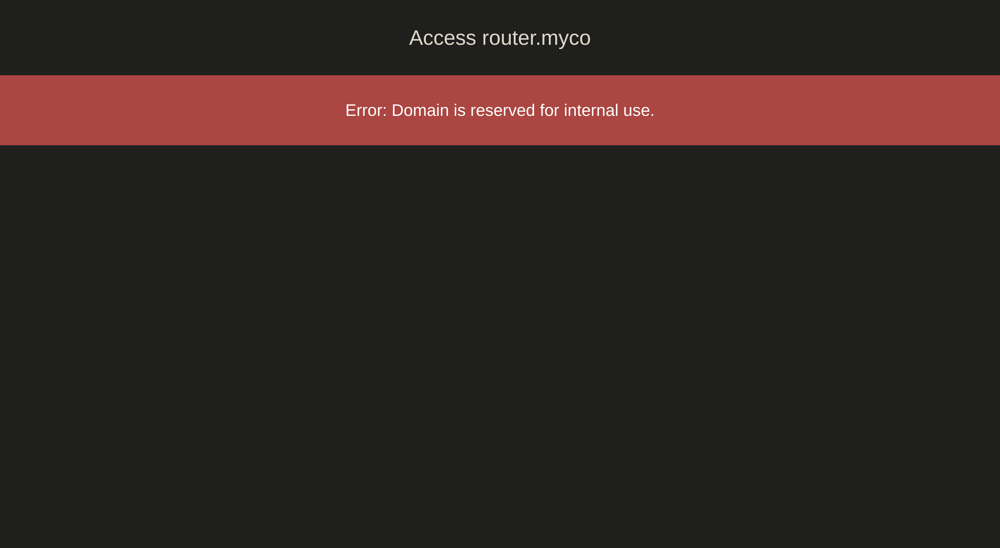

{ width="150" align=right }

# __Mycoria__

Mycoria is an open and secure overlay network that connects all participants. It values freedom of connectivity and aims to imitate the curious and adventurous spirit of the early Internet:

- ==Everyone is equal==: Easily connect to anyone
- ==Everyone is welcome==: Open network without bureaucracy
- No spooking: Everthing is authenticated
- No surveillance: Everything is encrypted (+ Private Addresses!)
- No barriers: Connect via the Internet or extend Mycoria with your own mesh

### Design Goals

- Keep it small and simple
- Compatible with existing infrastructure (eg. DNS)
- ==Secure by default==
- Private by default (WIP)

### Features

- ==Automatic end-to-end encryption==
- Modern cryptography
- Smart and scalable routing (partly WIP)
- Resolve .myco DNS (OS configuration required)
- Rotating private addresses (WIP)
- Dashboard (WIP)
- Auto-Optimization/Healing of Network (for Internet overlay) (WIP)
- Simple Service Discovery (WIP)

[Continue reading about the concept.](/concept/)

## Dashboard Impressions

